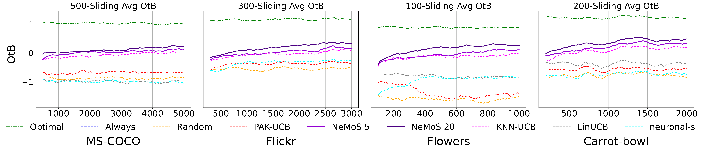

<h1 align="center">🎯 NeMoS</h1>
<h3 align="center"><b>Ne</b>arest Neighbors Bandit meets Active Learning for Online <b>Mo</b>del <b>S</b>election</h3>

<p align="center">
  <a href="https://openreview.net/forum?id=CSjewjplO1"></a>
  
  
</p>

<p align="center"><b>Route every prompt to the model that scores highest on it — online, non-parametric, with provable regret.</b></p>

Which text-to-image model scores best is **prompt-dependent**. NeMoS routes each incoming prompt
with a **contextual bandit** that estimates rewards from *nearest-neighbor* prompts and spends a
small **active-learning budget** only where the choice is a near-tie. Rewards are the automatic
metrics used in the paper — CLIPScore, ImageReward and HPSv2 — not human preference judgements.

On the paper's **text-to-image model selection** benchmarks, evaluated with **automatic metrics
(CLIPScore, ImageReward, HPSv2)**, NeMoS:

- reduces cumulative regret by **up to 60%** relative to the PAK-UCB baseline (40–60% across the
  four datasets) — see the [regret table](docs/method.md#results) for the per-dataset numbers;
- attains a **higher average metric score than any single fixed model** in the candidate pool, by
  routing each prompt;
- keeps this advantage **when models are added to or removed from the pool mid-stream**.

It requires **no training**, and comes with a **poly-logarithmic regret bound** under the paper's
assumptions. These results are measured on the four prompt datasets and six models listed in
[docs/reproduce.md](docs/reproduce.md); they are not claims about human-judged image quality or
about model selection outside this setting.



## Quickstart

```bash
pip install -r requirements.txt && pip install -e .
```

```python
from nemos.algorithms.nemos import NeMoS
from nemos.rewards import OnlineRewards

nemos = NeMoS(models, X, theta=1.0)           # X: (num_prompts, dim) embeddings — nothing to train
rewards = OnlineRewards(metric="clip")         # generate an image per step and score it
budget = int(0.2 * T)                          # 20% active-query budget

for t in range(1, T + 1):
    x_idx = stream[t - 1]
    prompt = prompts[x_idx]
    arm, gap, *_ = nemos.select_arm(x_idx, t)  # predicted best model for this prompt
    if gap < delta and budget > 0:             # Delta rule: query only on near-ties
        r = rewards.rewards(prompt, models)    # full feedback: every model on this prompt
        for g in models:
            nemos.update(x_idx, g, r[g])
        budget -= 1
    else:
        nemos.update(x_idx, arm, rewards.reward(prompt, arm))
```

Swap `OnlineRewards` for `PrecomputedRewards` to replay scores computed once offline — that is how
the paper's experiments run, and it needs no GPU. See
[where rewards come from](docs/reproduce.md#where-rewards-come-from).

## Documentation

- 📖 **[Method & results](docs/method.md)** — how NeMoS works, the regret table, and the theory.
- 🔬 **[Reproducing the experiments](docs/reproduce.md)** — repo layout, datasets, and how to run everything.
- 📄 **[Paper (TMLR)](https://openreview.net/forum?id=CSjewjplO1)** — full experiments, ablations, and proofs.

## Citation

```bibtex
@article{damidaux2026nemos,
  title   = {{NeMoS}: Nearest Neighbors Bandit meets Active Learning for Online Model Selection},
  author  = {Damidaux, Jules and Lewandowski, Basile and Farnia, Farzan and Chen, Lydia},
  journal = {Transactions on Machine Learning Research},
  issn    = {2835-8856},
  year    = {2026},
  url     = {https://openreview.net/forum?id=CSjewjplO1}
}
```

## License

Released under the [MIT License](LICENSE).
